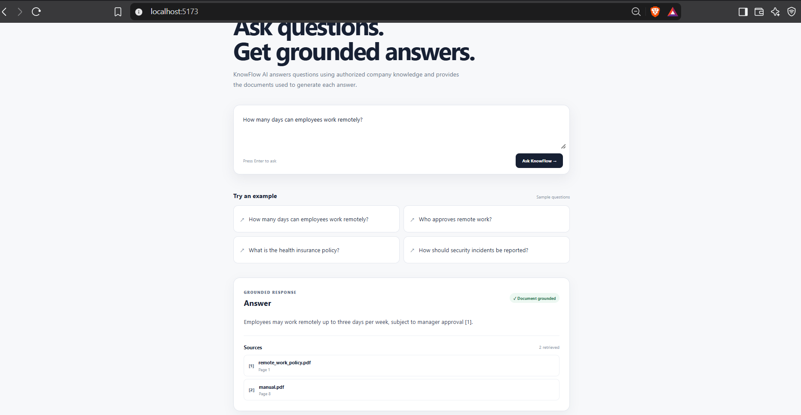
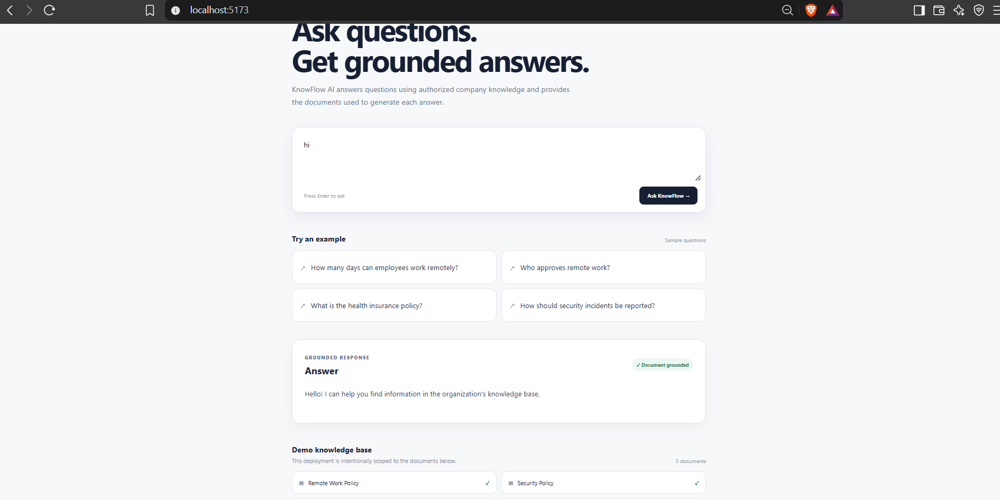

# KnowFlow AI


> **Hybrid-retrieval RAG knowledge assistant with cited answers and abstention**


KKnowFlow AI is a knowledge assistant that answers questions from an organization's internal documents instead of relying only on a general-purpose LLM.

The system retrieves relevant document passages, combines semantic and keyword search, reranks the results, and generates grounded answers with source citations. When the required information is not available, it abstains instead of inventing an answer.

## Demo

The application currently runs locally with a React frontend and FastAPI backend.

### Grounded answer with citations



### Query routing and knowledge-base UI



## Why KnowFlow?

A basic chatbot can produce fluent answers without proving where those answers came from. KnowFlow is designed around a different requirement:

**retrieve → verify → answer → cite**

The goal is to make answers traceable to the organization's source documents and to avoid answering questions that are outside the available knowledge base.

## Key Features

- **Retrieval-Augmented Generation (RAG)**
- **Hybrid retrieval**
  - PostgreSQL + pgvector semantic search
  - BM25 keyword search
  - Reciprocal Rank Fusion (RRF)
- **Cross-encoder reranking**
- **Grounded answers with source citations**
- **Hallucination-safe abstention**
- **Query routing**
  - greetings
  - knowledge questions
  - out-of-scope questions
- **Permission-aware retrieval metadata**
  - department
  - access level
- **Document versioning**
- **SHA-256 content hashing**
  - unchanged documents are not unnecessarily re-indexed
  - changed documents can create a new active version
- **RAG evaluation with RAGAS**
- **Retrieval evaluation**
- **Query observability**
  - latency
  - sources
  - access context
  - abstention status
- **FastAPI API**
- **React/Vite frontend**
- **PostgreSQL + pgvector**

## Architecture

```text
                    ┌──────────────────────┐
                    │     React / Vite     │
                    │      Frontend        │
                    └──────────┬───────────┘
                               │
                               ▼
                    ┌──────────────────────┐
                    │      FastAPI API     │
                    └──────────┬───────────┘
                               │
                               ▼
                    ┌──────────────────────┐
                    │    Query Router      │
                    └──────────┬───────────┘
                               │
                               ▼
              ┌────────────────────────────────┐
              │       Hybrid Retrieval         │
              │                                │
              │  pgvector       BM25           │
              │      \             /           │
              │       \           /            │
              │        └── RRF ──┘             │
              └────────────────┬───────────────┘
                               │
                               ▼
                    ┌──────────────────────┐
                    │ Cross-Encoder        │
                    │ Reranker             │
                    └──────────┬───────────┘
                               │
                               ▼
                    ┌──────────────────────┐
                    │ Grounded Context     │
                    │ + Source Citations   │
                    └──────────┬───────────┘
                               │
                               ▼
                    ┌──────────────────────┐
                    │ Gemini LLM           │
                    │ Grounded Generation  │
                    └──────────┬───────────┘
                               │
                               ▼
                    ┌──────────────────────┐
                    │ Answer + Citations   │
                    └──────────────────────┘
```

## RAG Pipeline

### 1. Document ingestion

PDF documents are loaded using LangChain's PDF loader and split into overlapping chunks using a recursive text splitter.

### 2. Embeddings

Document chunks are converted into vector embeddings using:

```text
sentence-transformers/all-MiniLM-L6-v2
```

### 3. Vector search

Embeddings are stored in PostgreSQL using the `pgvector` extension.

### 4. Keyword search

BM25 provides lexical retrieval for queries where exact terms are important.

### 5. Hybrid retrieval

Semantic and keyword results are combined using Reciprocal Rank Fusion (RRF).

### 6. Reranking

A cross-encoder reranks retrieved passages to improve the quality of the final context.

### 7. Grounded generation

The selected passages are provided to Gemini with strict instructions:

- use only the supplied context
- cite factual statements
- do not invent citations
- abstain when the context does not contain the answer

### 8. Response

The frontend displays:

- the generated answer
- grounded-response status
- source documents
- source pages

## Hallucination-Safe Behavior

KnowFlow is intentionally designed not to answer every question.

For example, when a user asks something outside the organization's knowledge base, the system can respond:

```text
I don't have enough information in the provided documents to answer that.
```

The query router also handles simple out-of-scope requests before running the full RAG pipeline.

## Document Versioning

KnowFlow tracks document versions using:

- stable document IDs
- version numbers
- active/archived status
- SHA-256 content hashes

For example:

```text
Document
   │
   ├── v1  archived
   │
   └── v2  active
```

When the same file is indexed again, its SHA-256 hash is compared with the active version. If the content is unchanged, indexing is skipped.

## Access-Aware Retrieval

Documents and chunks contain permission metadata:

```text
department
access_level
```

The retrieval layer can use these fields to restrict which chunks are eligible for a query.

This provides the foundation for enterprise-style permission-aware retrieval.

## Evaluation

The project includes a retrieval evaluation dataset containing answerable and unanswerable questions.

Current evaluation results:

| Metric | Result |
|---|---:|
| Recall@5 | **100%** |
| MRR | **1.000** |
| Abstention accuracy | **100%** |
| RAGAS Faithfulness | **0.917** |
| RAGAS Answer Relevancy | **0.895** |

> These results are from the project's current evaluation dataset and should not be interpreted as production-level accuracy guarantees.

The evaluation set has **15 questions (12 answerable, 3 unanswerable)** over a small demo corpus. The numbers show the pipeline works on this data, not how it would perform at scale.

Run the evaluations from the project root:

```powershell
python -m evals.evaluate_retrieval
python -m evals.evaluate_ragas
```

`evaluate_ragas` uses a Groq-hosted model as the judge, so it needs `GROQ_API_KEY` in `.env`. The app itself only needs `GEMINI_API_KEY`.

## Tech Stack

### Backend

- Python
- FastAPI
- SQLAlchemy
- PostgreSQL
- pgvector

### RAG

- LangChain
- Sentence Transformers
- BM25
- Cross-Encoder
- Gemini

### Evaluation

- RAGAS
- Custom retrieval evaluation

### Frontend

- React
- Vite
- CSS

### Infrastructure / Development

- Docker
- Git / GitHub
- VS Code

## Project Structure

```text
knowflow-ai/
│
├── app/
│   ├── main.py
│   ├── models.py
│   │
│   ├── db/
│   │   ├── database.py
│   │   ├── models.py
│   │   ├── init_db.py
│   │   ├── create_tables.py
│   │   └── versioning.py
│   │
│   ├── rag/
│   │   ├── ingestion.py
│   │   ├── embeddings.py
│   │   ├── vector_store.py
│   │   ├── retriever.py
│   │   ├── hybrid_search.py
│   │   ├── reranker.py
│   │   ├── query_router.py
│   │   ├── llm.py
│   │   └── pipeline.py
│   │
│   └── observability/
│       └── logger.py
│
├── evals/
│   ├── dataset.json
│   ├── evaluate_retrieval.py
│   └── evaluate_ragas.py
│
├── tests/
│   ├── conftest.py
│   ├── test_api.py
│   ├── test_hybrid_search.py
│   ├── test_ingestion_and_indexing.py
│   ├── test_integration.py
│   ├── test_pipeline.py
│   ├── test_query_router.py
│   └── test_reranker.py
│
├── scripts/
│   ├── index_all.py
│   └── index_pdf.py
│
├── frontend/
│   └── src/
│
├── .github/workflows/ci.yml
├── data/
├── pytest.ini
├── requirements.txt
├── docker-compose.yml
└── README.md
```

## Local Setup

### 1. Clone the repository

```bash
git clone https://github.com/vishal0205/knowflow-ai.git
cd knowflow-ai
```

### 2. Create a virtual environment

Windows PowerShell:

```powershell
python -m venv .venv
.venv\Scripts\Activate.ps1
```

### 3. Install dependencies

```powershell
pip install -r requirements.txt
```

### 4. Start PostgreSQL + pgvector

```powershell
docker compose up -d
```

### 5. Configure environment variables

Create a `.env` file:

```env
APP_ENV=development

POSTGRES_USER=knowflow
POSTGRES_PASSWORD=knowflow_password
POSTGRES_DB=knowflow
POSTGRES_HOST=localhost
POSTGRES_PORT=5432

GEMINI_API_KEY=your_gemini_api_key
GROQ_API_KEY=your_groq_api_key
```

Never commit `.env` or API keys to GitHub.

### 6. Create database tables

```powershell
python -m app.db.create_tables
```

### 7. Add and index documents

Put your PDF files in `data/documents/` (create the folder if needed), then run:

```powershell
python -m scripts.index_all
```

To index a single file, edit the path in `scripts/index_pdf.py` and run `python -m scripts.index_pdf`.

### 8. Run the backend

```powershell
uvicorn app.main:app --reload
```

Backend:

```text
http://127.0.0.1:8000
```

Swagger API documentation:

```text
http://127.0.0.1:8000/docs
```

### 9. Run the frontend

```powershell
cd frontend
npm install
npm run dev
```

Frontend:

```text
http://localhost:5173
```

## API

### Health check

```http
GET /health
```

Example:

```json
{
  "status": "healthy"
}
```

### Query

```http
POST /query
```

Example request:

```json
{
  "question": "How many days can employees work remotely?",
  "department": null,
  "access_level": "employee"
}
```

The API returns the grounded answer and source information.

## Testing

The project has two kinds of tests.

**Unit tests** replace the database, the Gemini API and the ML models with mocks, so they need no setup. They cover query routing, Reciprocal Rank Fusion, BM25 search, reranking, the pipeline (citations and abstention), the FastAPI endpoints, and document hashing. They run automatically on every push with GitHub Actions.

```powershell
pytest -m "not integration"
```

**Integration tests** need the real PostgreSQL database, a Gemini API key and indexed documents, so they run locally only:

```powershell
pytest -m integration
```
## Example Questions

The demo knowledge base supports questions such as:

```text
How many days can employees work remotely?

Who approves remote work?

What is the health insurance policy?

How should security incidents be reported?
```

The system can also abstain when the requested information is outside the available documents.

## Design Decisions

### Why hybrid retrieval?

Vector search captures semantic similarity, while BM25 is useful for exact terms and policy-specific language. Combining both provides a more robust retrieval strategy than relying on only one retrieval method.

### Why reranking?

Initial retrieval is optimized for recall. The cross-encoder reranker provides a second relevance stage before the final context is sent to the LLM.

### Why abstention?

A knowledge assistant should not fabricate an answer when the required information is missing. KnowFlow explicitly instructs the generation layer to abstain when the retrieved context is insufficient.

### Why document hashes?

Re-indexing an unchanged document wastes computation and can create unnecessary versions. SHA-256 content hashing lets the system detect unchanged content before indexing.

## Current Limitations

- The current demo uses a local development deployment.
- The demo corpus is intentionally small.
- Authentication and a complete user-management system are not included.
- Evaluation results are based on the project's test dataset rather than a production workload.
- The current document ingestion path focuses on PDF documents.
- `access_level` is sent by the client and there is no authentication, so the department and access filters demonstrate metadata filtering, not secure access control.
- The BM25 index is rebuilt from the database on every query. This is fine for a small corpus but would need caching at larger scale.
- The keyword-based query router can misroute some company questions (for example, ones containing "Python code").

## Future Improvements

- Production authentication and role management
- More document formats and connectors
- Background ingestion jobs
- Document upload management UI
- Advanced query decomposition / multi-hop retrieval
- Production monitoring dashboards
- Cloud deployment (CD)
- Larger evaluation datasets
- More comprehensive permission models


## DONE BY

**Vishal**

AI / ML Engineering Project

GitHub: https://github.com/vishal0205
